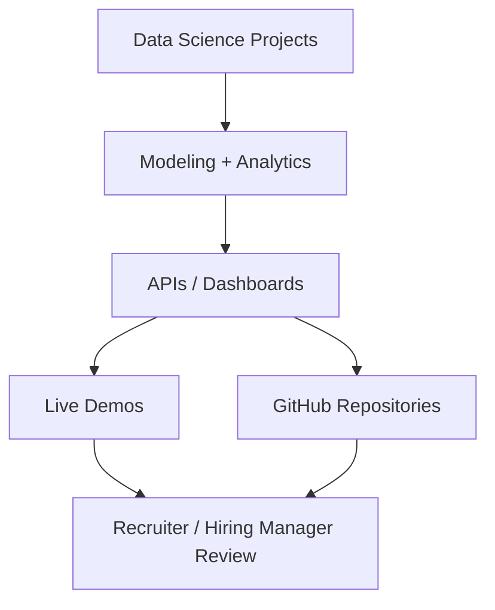

# Hi, I'm Praveen Raj A

> Data Scientist and AI/ML Engineer building production-style analytics, GenAI, NLP, MLOps, computer vision, and business intelligence projects.

---

## About Me

I build end-to-end data science systems: not only notebooks, but deployed Streamlit apps, APIs, model monitoring workflows, retrieval-augmented generation tools, and business-ready analytics dashboards.

My project portfolio focuses on:

- Machine learning and predictive analytics
- Generative AI, RAG, and document intelligence
- MLOps and model governance
- Labor market intelligence
- Retail demand forecasting and anomaly detection
- Credit, churn, fraud, and bankruptcy risk analytics
- Computer vision quality inspection

---

## Featured Projects

| Project | Domain | Live / Repo |
|---|---|---|
| Enterprise Document Intelligence v2.0 | Agentic AI, RAG, document risk | [Live App](https://enterprise-document-agentic-ai-v20-fqmmi6vktezorfdwxrrcep.streamlit.app/) |
| LaborIQ v2.0 | Labor market intelligence | [Repository](https://github.com/praveenraj9623-sketch/laboriq-v2.0) |
| MLOps Model Governance Platform | Model monitoring and governance | [Live App](https://end-to-end-mlops-model-governance-platform-et3unrnhvmpv6xscxql.streamlit.app/) |
| Customer Churn Intelligence Platform | Churn prediction and retention analytics | [Live App](https://customer-churn-intelligence-platform-gleon7xy6mucndm74impde.streamlit.app/) |
| Real-Time Fraud Detection System | Streaming fraud analytics | [Repository](https://github.com/praveenraj9623-sketch/Real-Time-Fraud-Detection-System) |
| Tamil-English NLP Intelligence Suite | NLP, speech, sentiment | [Repository](https://github.com/praveenraj9623-sketch/tamil-english-nlp-intelligence-suite) |
| Computer Vision Quality Inspection | Defect detection and Grad-CAM | [Live App](https://computer-vision-quality-inspection-qkv9autqvpnjyoz5tzn8n3.streamlit.app/) |

---

## Technical Stack

| Area | Tools |
|---|---|
| Programming | Python, SQL, JavaScript |
| Data Processing | Pandas, NumPy, PySpark, DuckDB |
| Machine Learning | scikit-learn, XGBoost, LightGBM |
| Deep Learning / CV | TensorFlow, Keras, OpenCV |
| NLP / GenAI | LangChain, Groq, sentence-transformers, ChromaDB, FAISS |
| MLOps | MLflow, DVC, model registry patterns, drift monitoring |
| APIs | FastAPI, Uvicorn, Pydantic |
| Dashboards | Streamlit, Plotly |
| Deployment | Docker, Docker Compose, GitHub Pages, Streamlit Cloud |

---

## Portfolio Architecture

---

## Contact

- Portfolio: https://praveenraj9623-sketch.github.io/
- LinkedIn: https://www.linkedin.com/in/praveen-raj-a-b05abb2a3/
- GitHub: https://github.com/praveenraj9623-sketch
